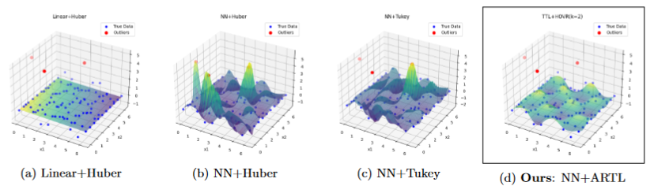

# ARTL
Augmented and Regularized Trimmed Loss for Robust Trainig of Neural Network

## Overview
This repository provides source codes to reproduce the experimental results presented in our manuscript: 
```
@article{okuno2024ARTL,
    year      = {2024},
    publisher = {CoRR},
    volume    = {},
    number    = {},
    pages     = {},
    author    = {Akifumi Okuno and Shotaro Yagishita},
    title     = {Outlier-Robust Neural Network Training: Efficient Optimization of Transformed Trimmed Loss with Variation Regularization},
    journal   = {arXiv preprint arXiv:xxxx.xxxxx}
}
```


## Contact Info.
Akifumi Okuno (okuno@ism.ac.jp)
